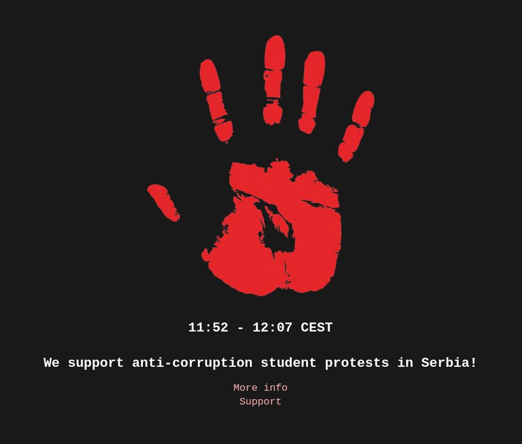

<h1 align="center">
    <a href="https://github.com/shellmonk/rsvk">
    
    </a>
    <br />
    rsvk (Ruke Su Vam Krvave)
</h1>

## What is rsvk

rsvk (Ruke Su Vam Krvave) is single JS overlay you can add to your website to support [anti-corruption protests in Serbia](https://en.wikipedia.org/wiki/2024%E2%80%932025_Serbian_anti-corruption_protests).

Corruption of the ruling party killed 16 people and injured 1 more in Novi Sad on November 1st, 2024, when canopy of the Novi Sad railway station collapsed.

Help us fight the corrupt system and spread the word.

Overlay will be visible on your website from 11:52 to 12:07 CEST.

## Usage

Just add

```html
<script type="text/javascript" src="https://cdn.jsdelivr.net/npm/@shellmonk/rsvk@0.0.6/dist/rsvk.min.js"></script>
```

to your website.

## Known bugs

## License

This project is licensed under the [MIT License](http://opensource.org/licenses/MIT).
